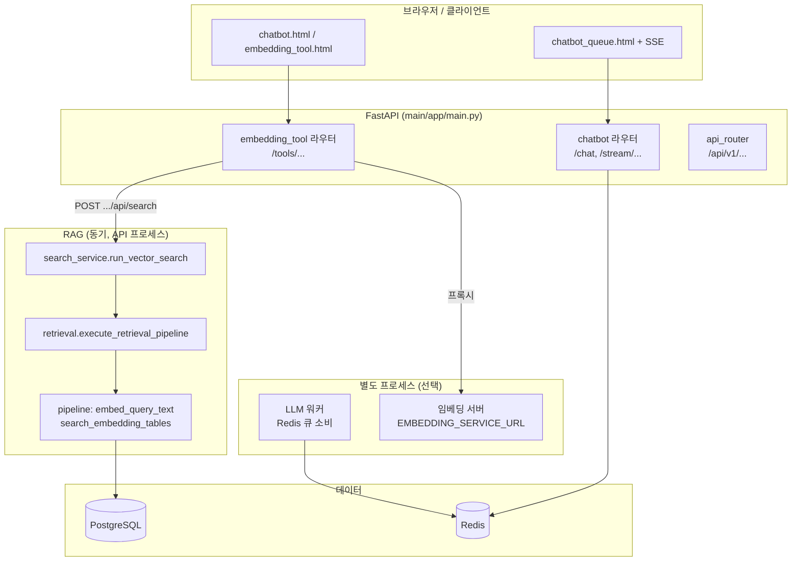

# 챗봇·RAG·퀵메뉴 아키텍처

이 문서는 **현재 이 저장소에서 “챗봇”이 동작하는 경로**를 한곳에 정리한다.  
(이름은 챗봇이지만, 실제로는 **Redis 큐형 스트리밍 챗**과 **동기 RAG 검색 UI** 두 갈래가 있다.)

---

## 1. 전체 그림

---

## 2. 경로 A: 임베딩 도구 + RAG 검색 (메인 RAG 챗 UX)

| 단계 | 설명 |
|------|------|
| 진입 | `GET /tools/chatbot` 등 → `main/app/api/routes/embedding_tool.py` 가 Jinja 템플릿 반환 |
| 검색 API | `POST /tools/embedding/api/search` → `run_vector_search()` (`main/app/rag/search_service.py`) |
| 세션 | 폼으로 `session_id` 를 넘기면, DB에서 최근 대화를 읽어 `ConversationMemory` + `has_history` 로 후행·의도 분류에 반영 |
| 파이프라인 | `execute_retrieval_pipeline()` (`orchestrator.py`): 의도·`retrieval_topic`·언어·쿼리 계획·벡터 검색·RRF·컨텍스트 조립 |
| 벡터 | `pipeline.py` 의 `embed_query_text` / `search_embedding_tables` (원격이면 `EMBEDDING_SERVICE_URL` HTTP) |
| 저장 | 세션 있을 때 사용자 메시지는 **검색·분류 완료 후** `MessageService` → `message` + `message_meta` (intent, `retrieval_topic`, `is_followup` 등) |
| 답변 | `answer_mode`: `template` 또는 OpenAI 기반 |

**관련 파일**

- `main/app/api/routes/embedding_tool.py` — UI + search + **QA 퀵메뉴 JSON API**
- `main/app/rag/search_service.py` — 세션 hydrate, 파이프라인 호출, 저장, 응답 조립
- `main/app/rag/retrieval/orchestrator.py` — 단계별 `step_logs`
- `main/app/rag/retrieval/intent.py` — 라우팅 intent + `retrieval_topic` 이중 축
- `main/app/rag/retrieval/planning.py` — 다중 검색 쿼리 생성
- `main/app/rag/retrieval/search.py` — 실제 벡터 검색 호출
- `main/app/rag/pipeline.py` — pgvector 테이블·임베딩

---

## 3. 경로 B: Redis 큐 + SSE (“큐 챗봇”)

| 단계 | 설명 |
|------|------|
| 질문 등록 | `POST /chat` (`main/app/api/routes/chatbot.py`) — 본문을 Redis 리스트 큐에 JSON으로 push |
| 스트림 | `GET /stream/{request_id}` — 워커가 다른 리스트에 쌓은 토큰/이벤트를 SSE로 소비 |
| 캐시 | 동일 질문 SHA 캐시 키로 Redis GET → 히트 시 즉시 done 이벤트 |
| 워커 | 이 저장소 밖의 프로세스가 `llm_queue_name` 을 소비한다고 가정 (구현은 배포 쪽) |

**API는 LLM을 직접 호출하지 않는다.** 큐 적재 + 추적(`trace`) + SSE만 담당한다.

---

## 4. REST API v1 (`/api/v1`)

`main/app/api/router.py` — `health`, `companies`, `products` 등 **버전 프리픽스 아래** REST.  
RAG 검색은 여기 없고 `/tools/embedding/api/search` 에 있다.

---

## 5. QA 카테고리 퀵메뉴 (`kprint_qa_quickmenu`)

CSV (`docs/kprint QA bot_초안.csv`) → Alembic 테이블 → `scripts/load_kprint_qa_quickmenu.py` 적재.

| HTTP | 용도 |
|------|------|
| `GET /tools/embedding/api/qa-quickmenu/primary` | `primary_question=true` 메인 1차 버튼 후보 |
| `GET /tools/embedding/api/qa-quickmenu/by-parent?parent_id=ko1` | 같은 `parent_id` 그룹 |
| `GET /tools/embedding/api/qa-quickmenu/{qna_code}` | 단일 행 |
| `GET /tools/embedding/api/qa-quickmenu/{qna_code}/follow-links` | `follow_question*` / `default_quickmenu` 에 적힌 코드 순서로 다음 행 |

**코드**

- `main/app/db/repositories/kprint_qa_quickmenu_repository.py`
- `main/app/db/models/kprint_qa_quickmenu.py`

---

## 6. DB 테이블 요약

| 테이블 | 역할 |
|--------|------|
| `conversation_sessions` | 대화 세션 PK(UUID). 문자열 `session_id` 는 서비스에서 UUID로 매핑 |
| `messages` | user/assistant 메시지 본문 |
| `message_meta` | 사용자 메시지별 intent, `retrieval_topic`, follow-up, confidence |
| `kprint_*` (임베딩) | 참가업체·전시품 원본 + pgvector 임베딩 테이블 (RAG 검색 대상) |
| `kprint_qa_quickmenu` | 전시 QA 퀵메뉴/카테고리 (RAG와 별도 트리 UI용) |

---

## 7. 환경 변수 (자주 쓰는 것)

| 변수 | 용도 |
|------|------|
| `DATABASE_URL` | Postgres (동기 `app.db` + 비동기 `app.db.session`) |
| `EMBEDDING_SERVICE_URL` | 쿼리 임베딩 HTTP 프록시 대상 |
| `OPENAI_API_KEY` | 의도 보조·답변 생성 (선택) |
| `REDIS_URL` | 큐 챗봇 캐시/스트림/큐 |

---

## 8. 로컬 개발 순서 (요약)

1. Postgres + Redis 기동, `.env` 에 URL 설정  
2. `alembic upgrade head`  
3. 임베딩·CSV 적재 스크립트는 `scripts/` 참고  
4. `uvicorn app.main:app` 은 보통 `main` 을 PYTHONPATH 에 두고 실행  

---

## 9. 용어 정리

| 용어 | 의미 |
|------|------|
| 라우팅 intent | `greeting`, `followup`, `company`, `product`, `general`, `not_related` 등 — 검색 생략 여부·LLM 톤 |
| `retrieval_topic` | `company` / `product` / `all` — 벡터 검색 `entity_scope` |
| `primary_question` (QA 테이블) | 메인 화면에서 먼저 노출할 퀵메뉴 행 여부 (RAG intent 와 별개) |

문서 갱신 시점: 저장소 내 코드 기준. 배포 환경별 URL·워커는 다를 수 있다.
