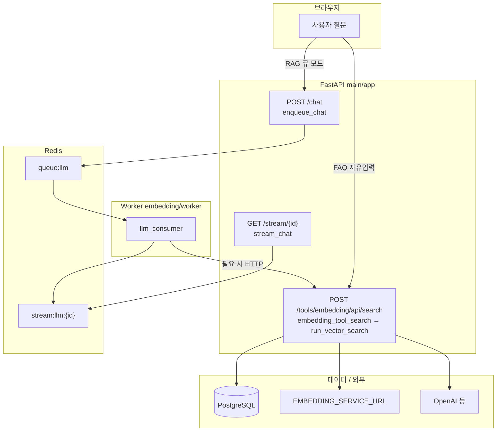
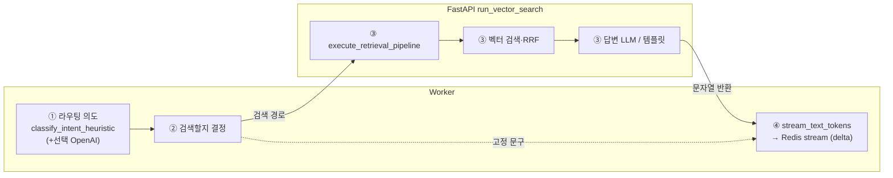

# 챗봇 프로세스 흐름 (서버·함수·순서)

전체 아키텍처 개요는 [`CHATBOT_ARCHITECTURE.md`](./CHATBOT_ARCHITECTURE.md)를 참고하고, 이 문서는 **사용자 질문이 어떤 순서로 어떤 함수/엔드포인트를 타는지**만 정리한다.

---

## 역할 한눈에 보기 (의도 / 벡터 / 답변 LLM)

| 구분 | 주로 어디서 |
|------|-------------|
| **본격 의도·검색 주제·후행 판단·벡터 검색·검색 후 답변 LLM** | FastAPI `run_vector_search` → `execute_retrieval_pipeline` 등 (`main/app/rag/`) |
| **큐 모드에서의 가벼운 라우팅 의도** (검색 API 호출 여부) | Worker `llm_consumer` → `classify_intent_heuristic` (+ 선택 `openai_refine_worker_routing_intent`) |
| **SSE로 글자가 쪼개져 보이는 것** | Worker `stream_text_tokens` — **추가 LLM이 아니라** 완성된 문자열을 잘라 Redis에 `delta` 이벤트로 적재 |

---

## A. FAQ 자유 입력 (React `visitor_faq` / `exhibitor_faq` → 동기 검색만)

| 순서 | 서버·런타임 | 호출 | 하는 일 |
|:---:|:---|:---|:---|
| 1 | 브라우저 | `ChatbotPage.runFaqFreeText` | 사용자 메시지 수신, 봇 placeholder |
| 2 | 브라우저 | `postFaqSearch` (`main/frontend/src/api/client.ts`) | `POST /tools/embedding/api/search` (Form: `faq_only`, `faq_user`, `session_id`, `query` 등) |
| 3 | FastAPI (main) | `embedding_tool_search` (`main/app/api/routes/embedding_tool.py`) | 폼 검증 후 `run_vector_search` 호출 준비 |
| 4 | FastAPI (main) | `run_vector_search` (`main/app/rag/search_service.py`) | FAQ 게이트: `faq_only` / `faq_user` 있으면 **RAG·벡터 경로 전에** FAQ 엔진만 시도 |
| 5a | FastAPI (main) | `FaqSearchService.search_and_build_payload` (`main/app/rag/faq.py` 등) | DB 기반 FAQ 매칭·응답 조립 → **매칭되면 여기서 즉시 return** (의도/벡터/`execute_retrieval_pipeline` 없음) |
| 5b | FastAPI (main) | `run_vector_search` 내부 분기 | FAQ 전용 모드인데 매칭 실패 시 **고정 “매칭 없음” JSON** — 벡터·`execute_retrieval_pipeline` 안 탐 |
| 6 | 브라우저 | `runFaqFreeText` 후반 | `answer` / `answer_korean`, `follow_up_questions`로 UI 갱신 |

---

## B. RAG 동기 검색만 (임베딩 도구 UI, 또는 Worker가 부르는 `POST .../api/search`)

| 순서 | 서버·런타임 | 호출 | 하는 일 |
|:---:|:---|:---|:---|
| 1 | 클라이언트 | `fetch` / `httpx` 등 | `POST /tools/embedding/api/search` |
| 2 | FastAPI (main) | `embedding_tool_search` | `run_vector_search` 호출 |
| 3 | FastAPI (main) | `run_vector_search` | (선택) `external_id` 마커면 DB 직조회 분기; OpenAI면 `_generate_korean_answer_with_openai` 등 |
| 4 | FastAPI (main) | `run_vector_search` | `session_id` 있으면 `sync_load_memory_for_session` + `is_followup_v2` 등으로 **대화 맥락** 적재 |
| 5 | FastAPI (main) | `execute_retrieval_pipeline` (`main/app/rag/retrieval/orchestrator.py`) | **본 의도·토픽·쿼리 플랜·벡터 검색·RRF·컨텍스트** (임베딩은 설정에 따라 원격 `EMBEDDING_SERVICE_URL`) |
| 6 | FastAPI (main) | `run_vector_search` (후단) | `enrich_results_with_entity_detail_sync`, `sanitize_rag_results_for_user`, `apply_cutoff_and_build_context` 등 결과 정리 |
| 7 | FastAPI (main) | `run_vector_search` | `response_mode`에 따라 휴리스틱 답 또는 `build_korean_search_answer` / OpenAI 답변 분기 |
| 8 | FastAPI (main) | `embedding_tool_search` | `JSONResponse`로 클라이언트에 반환 |

---

## C. 큐 RAG (React `company_rag` 등: `POST /chat` + Worker + 필요 시 표 B와 동일 검색)

| 순서 | 서버·런타임 | 호출 | 하는 일 |
|:---:|:---|:---|:---|
| 1 | 브라우저 | `ChatbotPage.runRagPipelineFixed` | 봇 placeholder, `postChatQueue` 호출 |
| 2 | 브라우저 | `postChatQueue` | `POST /chat` (Form: `session_id`, `message`) |
| 3 | FastAPI (main) | `enqueue_chat` (`main/app/api/routes/chatbot.py`) | `request_id` 발급, trace 기록, **캐시 키** 조회 |
| 4 | FastAPI (main) | `enqueue_chat` | 캐시 히트 시: `stream:llm:{id}`에 `final`(전문) + `done` **RPUSH** 후 JSON만 반환 (큐 없음) |
| 5 | FastAPI (main) | `enqueue_chat` | 캐시 미스: **`queue:llm`에 job JSON RPUSH** (`request_id`, `session_id`, `message`, `cache_key`) |
| 6 | 브라우저 | `streamChatAnswer` | `EventSource`로 **`GET /stream/{request_id}`** 구독 |
| 7 | FastAPI (main) | `stream_chat` (`chatbot.py`) | Redis `stream:llm:{id}` **LPOP** 루프로 SSE 전송 |
| 8 | Worker (`embedding/worker`) | `llm_consumer` (`embedding/worker/consumers.py`) | `WorkerQueue.pop`으로 **큐에서 job 수신** |
| 9 | Worker | `classify_intent_heuristic` (`embedding/worker/llm.py`) | **워커 전용 라우팅 의도** (검색 API 호출 여부 분기) |
| 10 | Worker | (선택) `openai_refine_worker_routing_intent` (`embedding/worker/router_openai.py`) | 휴리스틱이 `general`일 때만, 설정·키 있으면 **라우팅 재판** |
| 11a | Worker | `_answer_retrieval` (`consumers.py`) | 검색 경로면 **`httpx`로 `POST {API}/tools/embedding/api/search`** |
| 12a | FastAPI (main) | `embedding_tool_search` → `run_vector_search` → … | **표 B의 3~7과 동일** (의도·벡터·답변 LLM은 전부 API 안) |
| 13a | Worker | `_answer_retrieval` 반환 처리 | `answer_korean`, `suggestion_cards`, `follow_up_questions` 추출; `step_logs`를 Redis trace에 펼침 |
| 11b | Worker | `_heuristic_answer` | 검색 생략 경로면 **고정 문장**만 사용 (`_answer_retrieval` 없음) |
| 14 | Worker | `stream_text_tokens` (`embedding/worker/llm.py`) | **완성된 문자열**을 잘라 Redis에 `delta` 이벤트 **RPUSH** |
| 15 | Worker | `llm_consumer` | `citation`(제안 카드) / `recommendation`(후속 질문) RPUSH, 답 **Redis 캐시 SET**, `done` RPUSH (`stage`·`retrieval` SSE도 동일 스트림에 기록) |
| 16 | FastAPI (main) | `stream_chat` | LPOP으로 쌓인 이벤트를 SSE로 브라우저에 전달 |
| 17 | 브라우저 | `streamChatAnswer` | `onToken` / `onCards`(내부적으로 `delta`·`citation` 이벤트 구독, 레거시 `token`/`cards` 병행)로 UI 갱신 후 종료 |

**표 C에서 “의도·벡터·검색 후 LLM”이 한 번에 도는 구간**은 **11a 이후의 FastAPI `run_vector_search` 한 줄기**이고, Worker는 **9~10(가벼운 라우팅)** + **14~15(스트림·캐시)** 이다.

---

## D. 저장 FAQ 칩만 선택 (큐·검색 API 없음)

| 순서 | 서버·런타임 | 호출 | 하는 일 |
|:---:|:---|:---|:---|
| 1 | 브라우저 | `handleStoredAnswer` (`ChatbotPage.tsx`) | `fetchQuickmenuDetail` → `GET .../qa-quickmenu/{qna_code}` |
| 2 | FastAPI (main) | QA 퀵메뉴 라우트 (`embedding_tool.py` 등) | DB에서 행 조회 후 JSON |
| 3 | 브라우저 | `streamFaqBlocks` | 받은 텍스트를 **클라이언트에서만** 타이핑 연출 |

---

## 참고: 전체 구조 (Mermaid)

---

## 문서 갱신

저장소 코드 기준으로 작성되었다. 엔드포인트·함수명이 바뀌면 이 파일과 `CHATBOT_ARCHITECTURE.md`를 함께 맞출 것.
